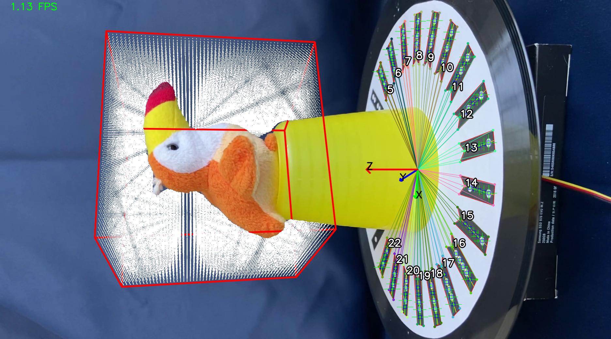

# Silhouette-Based Space Carving
The goal of this project is to implement technique known as [“space carving"](https://www.cs.toronto.edu/~kyros/pubs/00.ijcv.carve.pdf) to reconstruct the shape of a 
3D object from multiple photographs taken at known but arbitrarily distributed viewpoints. An object is placed 
on top of a rotating plate together with a custom-designed fiducal marker (see the following sections for details). 
The background is made of a uniform-colored material to be easily distinguished from the target object. A calibrated camera is
placed in front of the object capturing the scene throughout an entire rotation.

The volume occupied by the object is represented by a discrete set of voxels distributed on a cube of size N x N x N.
A voxel can be seen as the 3D extension of a “pixel” describing a property of a certain region of space. 
In this case, the property is being either occupied or not by our target object.

At each frame, a set of 3D rays exit the camera starting from the optical center and passing through each pixel of the image. Every ray may intersect some voxels before reaching either the background or the object itself.
If a ray reaches the background without touching the object, all the intersected voxels can be “carved” (ie. removed) as they represent empty space.
On the contrary, if a ray reaches the object, at least one of the intersected voxels is part of the object, so they must not be removed from the set.

For the space-carving technique being effective, two sub-problems must be solved at each frame i:
* Estimate the position of the camera with respect to the object (ie. the camera pose Ri, Ti)
* Find the “silhouette” of the object by clustering the pixels as part of the background or foreground

The complete algorithm works as follows:
* Let V be an initial set of voxels distributed in a N x N x N cube
* For each image:
	* Compute the camera Projection matrix P = K \[Ri Ti\]
  * Project all the voxels onto the image
  * Check if the projection of the voxel is inside or outside the silhouette. In the latter case, remove the voxel from V

When all the frames have been processed, the remaining set of voxels define the volume occupied by the object.


## Poject Structure
The project structure is divided into three subproject:
* Background foreground detection (*1_background_foreground_detection*)
* Markers Detector (*2_markers_detector*)
* Pose estimation (*3_pose_estimation*)
Each mini project is anassignmet which student cna decide to develop during the course or take the final project that require additional work.

The additional work is mainly summarize by the immplementation of the .ply file in order to export the object mesh built using the voxel structure.

The final project can be examined in the *space_carving* folder

## Requirements
```console
pip install numpy
pip install opencv-python
```

## Application Start Up
```console
cd space_carving
python space_carving.py
```

## Analyse the Results
The Mesh result of each object are stored in the *optput_project* folder, I recomend use [MeshLab](https://www.meshlab.net/#download) as software to deeply analyse the object shape.
